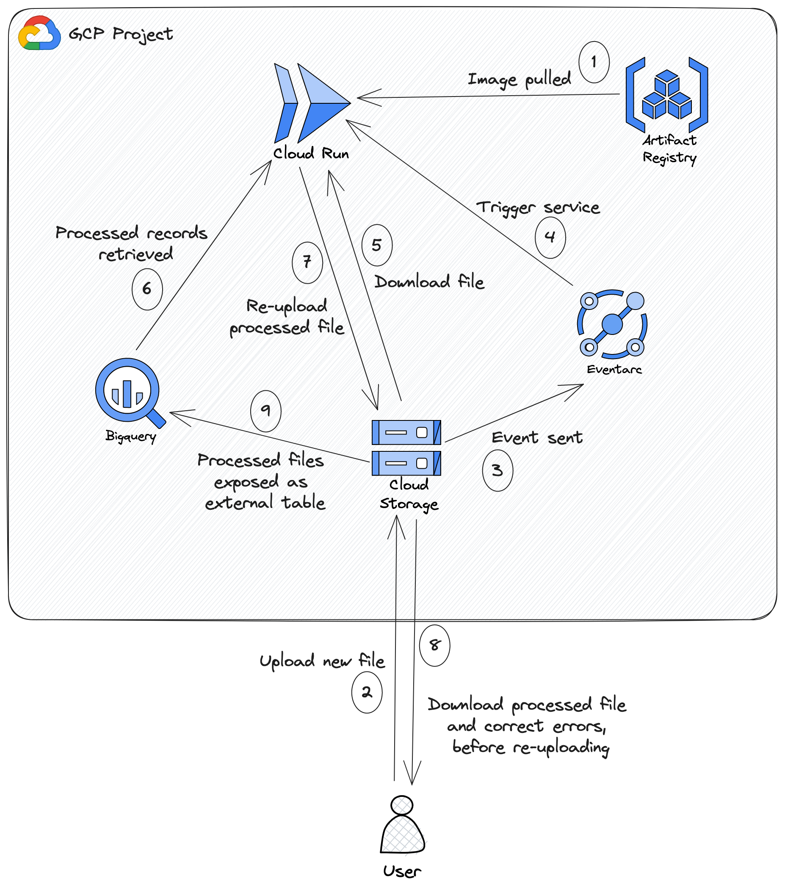

# Personal Bank Transaction Categorising

This project automates the categorising of Bank of New Zealand (BNZ) transactions. The 
categorising is done using the Levenshtein Distance to find the most similar transaction from an existing dataset of categorised 
transactions.
It uses Terraform to deploy the infrastructure required to run the workflow in Google Cloud Platform (GCP) using free tier services.
There is of course functionality similar to this offered by most banks now, but I personally prefer my own system as I already have 
years of data categorised my own way and also am able to analyse it far easier in BigQuery than through the banking app. My BigQuery table
which holds my categorised transaction data is linked to a Looker Studio dashboard.

## Overview

## How to Categorise Transactions

Unfortunately at the time of writing, BNZ (the bank I use) does not support an API for retrieving transaction records for personal banking. 
Open Banking in New Zealand has been on the horizon for some time now, but until then, retrieving bank transactions is still a manual process that 
requires navigating to the bank website, logging in with 2FA, and then downloading a CSV of transactions. The manual steps using this service are 
as follows:
1. Download CSV of transactions from BNZ website (transactions are deduplicated so it's fine to download for a period overlapping with the existing data).
2. Drop that CSV in the bucket in the `to_process` directory.
3. The processed file should appear in the `staging` directory within a few seconds. Download it.
4. Review the categories assigned and make corrections.
5. Upload to the `processed` directory.

A BigQuery external table points at the `processed` directory which can be used for analysis using queries or a visualisation tool such as Looker Studio.

## Deployment

### Local

The GCP infrastructure can be deployed by running `terraform apply` from the `/terraform` directory. At this stage several resources need to 
be created manually such as a project and an Artifact Registry, and some services need enabling. I intend on adding Terraform for that and making 
it completely reproducible in the near future. If running locally, after making changes to the Python script, the image should be built running 

`docker build -t {{ your GCP region}}-docker.pkg.dev/{{ your project id }}/{{ your artifact registry name }}/category-assigner:{{ a tag }} .` 

from the same directory as [the Dockerfile](Dockerfile) and then pushed with 

`docker push {{ your GCP region}}-docker.pkg.dev/{{ your project id }}/{{ your artifact registry name }}/category-assigner:{{ a tag }}`

In [terraform.tfvars](terraform/terraform.tfvars) there is a variable called `image_tag` which should be updated with `{{ a tag }}` in order to deploy 
the new image in the next `terraform apply`.

### CI

The CI is set up with a Github Action to automate the above process. This repository can be duplicated and the following steps done:
- create a project.
- create an Artifact Registry.
- create a service account to run the Terraform with.
- Follow these [steps](https://cloud.google.com/iam/docs/workload-identity-federation-with-deployment-pipelines) to setup workload identity federation with GCP.

On opening a PR, the image will be built and pushed if there are changes to the Python code and the tag updated in the Terraform variables.
On merge to the main/master branch, the Terraform will be applied.

## Considerations on Using This

The script that runs to categorise bank transactions was written specifically for my use with BNZ banking. I imagine other banks would have 
a similar structure to their transaction records ie payee, amount, reference fields etc. In general (I have not tested this), it may be possible just to modify the 
[data classes](python/src/data_classes.py). For example the `TransactionOriginal` data class you might modify the line `payee=row["Payee"]` to replace `"Payee"` with
whatever the equivalent name of the payee or payment name is in your bank's transactions. There is also the occasional thing hardcoded in the main [categorising script](python/src/category_assigner_v2.py)
such as custom logic for transactions from my wife's credit card using her maiden name. I intend on making this completely generic in the near future.

## My Evolution of Categorising Bank Transactions

I've been categorising my spending for the last five years, beginning with a completely manual workflow which consisted of me entering into a Google
Sheet a name for the transaction, the date, the amount, and a category. I would then manually copy this around the spreadsheet and create charts to demonstrate
things like the average spent monthly in a particular category or whether spending was increasing month by month. This would then influence whether I 
increased or decreased my budgets.

This was a very tedious workflow, and eventually I wrote a script to do some basic processing of a CSV of my transaction which I'd download from the BNZ website.
The script would do things like filter out non-purchase items (transfers between accounts, deposits) and automatically categorise very common purchases such as transactions
containing supermarket names or commonly visited petrol stations. After this script had run, I'd fill in the rest and paste into Google Sheets.

After reading an article on categorising bank transactions using Elasticsearch, I spent a period using this approach to automate things further. I would start up
a single node Elasticsearch instance locally and for each of my transactions, use the fuzzy search feature to find the most similar transaction and assign that 
category. I'd then again fix up issues and paste into Google Sheets. I'd also need to remember to load the newly categorised transactions into the Elasticsearch 
index. Feeling that starting up Elasticsearch locally each time felt tedious, I briefly investigated the idea of running a small cluster in the cloud which would have
been a ridiculous waste of money as even the smallest cluster is very expensive (to me at least). I also considered trying AWS's new serverless Elasticsearch, but even this
was expensive, and when the aim of the game is budgeting, I couldn't justify it.

The next attempt at automating further was investigating whether I could train a machine learning model to predict the categories. Using my dataset of about 1800
transactions I experimented with Random Forest and XGBoost models, but couldn't really get beyond high 60%'s accuracy. I decided perhaps I just didn't have enough data,
or my categories were not predictable enough (the models would especially struggle to differentiate between two categories - my allowance and my wife's allowance). I 
tried using GCP's autoML which got around 74% accuracy in one node hour of training, but slightly annoyingly cost me $30 and as far as I could tell didn't even give me the model parameters or
the feature engineering steps taken - it expected me to only use the model through Vertex AI which would obviously cost money.

For my final attempt, I rounded back to Elasticsearch, and came to the realisation that the fuzzy search used by Elasticsearch didn't require Elasticsearch at all, especially not
for 1800 records. I asked ChatGPT to provide me with the Levenshtein Distance algorithm (which is what Elasticsearch's fuzzy search is) and then used that in my script instead, getting about 
70% accuracy simply assigning the category of the most similar transaction name. At this point I also decided to switch from Google Sheets to GCP's BigQuery and make use of
Looker Studio for analysis. To round off the workflow I built this repository around the categorising script. 

## Future Work

- Add Terraform for enabling services.
- Make the script more easily customised.
- Make use of Open Banking API's once BNZ supports it.

## License 

This project is licensed under the terms of the MIT license.
